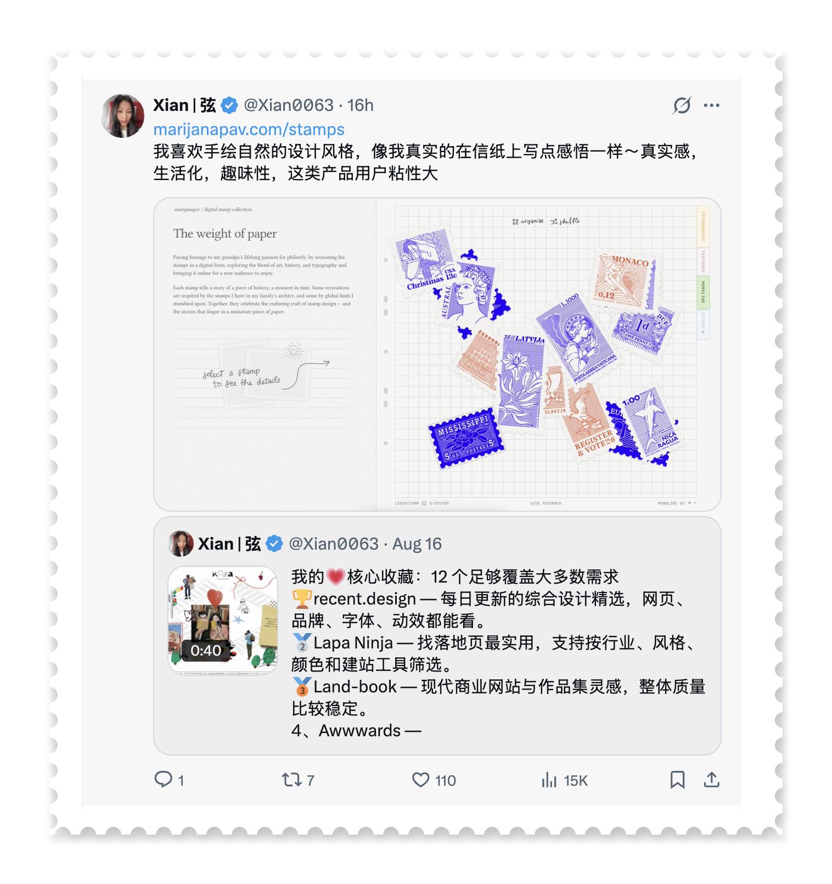

# stamp-edge

把任意图片处理成邮票风格的 Agent Skill:四周半圆打孔锯齿边 + 白色纸边 + 柔和投影,**默认输出真透明背景 PNG**(锯齿孔洞与四周 alpha=0),可直接叠加到任意背景上当贴纸/素材使用。



## 用法

```bash
pip install Pillow

# 透明背景(默认)
python3 stamp_effect.py <输入图> <输出图.png>

# 浅灰白底成品图
python3 stamp_effect.py <输入图> <输出图.png> bg
```

## 作为 Skill 安装

把整个目录放到你的 Agent skills 目录(如 `~/.agents/skills/stamp-edge/`),之后对 Agent 说"把这张图做成邮票边"即可触发。

## 可调参数(脚本顶部)

| 参数 | 默认值 | 说明 |
|------|--------|------|
| `margin` | 46 | 内容到锯齿边的白边宽度 |
| `hole_r` | 14 | 打孔半圆半径 |
| `pitch` | 46 | 打孔间距 |
| `outer_pad` | 90 | 邮票外留白(投影空间) |
| `shadow_alpha` | 70 | 投影不透明度 |

## 注意

- 微信等平台直接发图会把透明 PNG 压成 JPG 导致透明丢失,需保透明请以文件形式发送
